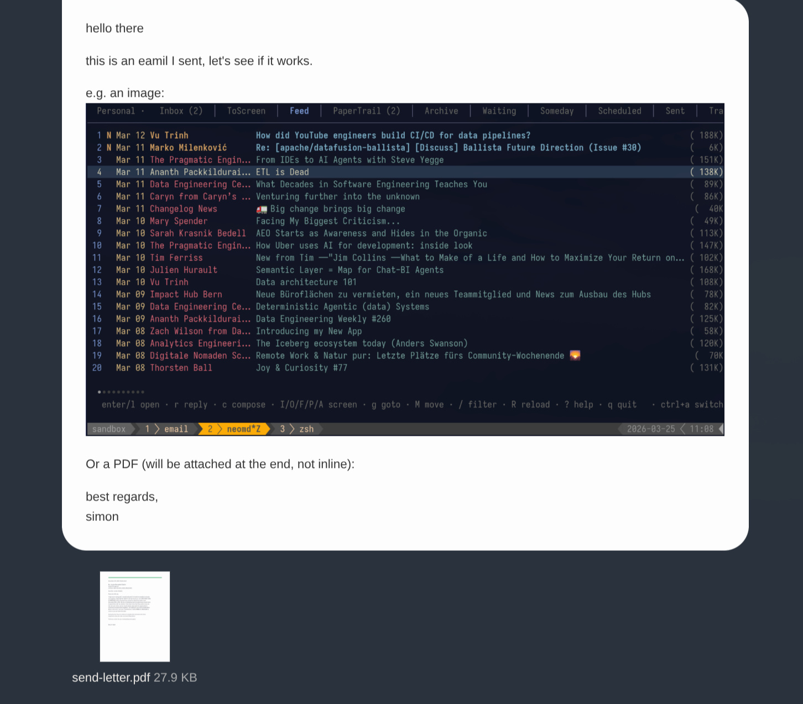
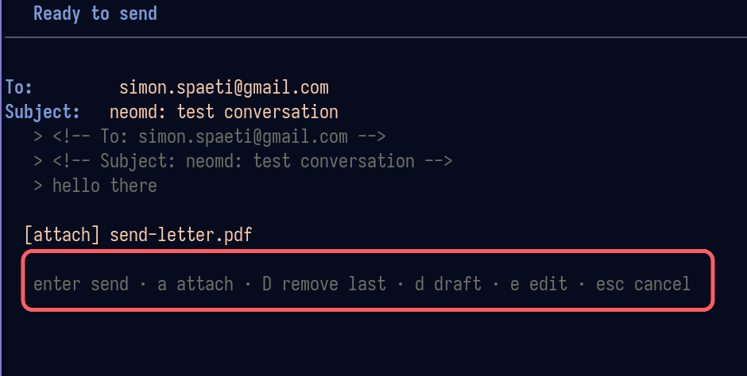

# neomd

A minimal terminal email client for people who write in Markdown and live in Neovim.

[Neomd](https://www.ssp.sh/brain/neomd/) is my way of implementing an email TUI based on my experience with Neomutt, focusing on [Neovim](https://www.ssp.sh/brain/neovim) (input) and reading/writing in [Markdown](https://www.ssp.sh/brain/markdown) and navigating with [Vim Motions](https://www.ssp.sh/brain/vim-language-and-motions) with the GTD workflow and [HEY-Screener](https://www.hey.com/features/the-screener/).

## The philosophy behind Neomd: What's unique?

The key here is **speed** in which you can **navigate, read, and process** your email. Everything is just a shortcut away, and instantly (ms not seconds). It's similar to the foundations that Superhuman was built on: it runs on Gmail and makes it fast with vim commands.

With the **HEY-Screener**, you get only emails in your inbox that you _screened in_, no spam or sales pitch before you added them. Or don't like them, just screen them out, and they get automatically moved to the "ScreenedOut" folder.

With the [GTD approach](https://www.ssp.sh/brain/getting-things-done-gtd), using folders such as next (inbox), waiting, someday, scheduled, or archive, you can move them with one shortcut. This allows you quickly to move emails you need to wait for, or deal with later, in the right category. **Processing your email only once**.

With the additional **Feed** and **Papertrail**, two additional features from HEY, you can read newsletters (just hit F) on them automatically in their separate tab, or move all your receipts into the Papertrail. Once you mark them as feed or papertrail, they will moved there automatically going forward. So you decide whether to read emails or news by jumping to different tabs.
## Screenshots

### Overview

Feed view with all Newsletters - also workflow with differnt tabs and unread counter only for certain tabs (not all):


### Reading Panel

Reading an email with Markdown 💙:


### Sent emails


Or in Gmail:


This is the markdown sent:

```markdown
<!-- To: email@domain.com -->
<!-- Subject: this is an email from neomd! -->

This email is from Neomd. Great I can add links such as [this](https://ssp.sh) with plain Markdown.

E.g. **bold** or _italic_.

## Does headers work too?

this is a text before a h3.

### H3 header

how does that look in an email?
Best regards
```

Compose emails in your editor, read them rendered with [glamour](https://github.com/charmbracelet/glamour), and manage your inbox with a [HEY-style screener](https://www.hey.com/features/the-screener/) — all from the terminal.

## Features

- **Write in Markdown, send beautifully** — compose in `$EDITOR` (defaults to `nvim`), send as `multipart/alternative`: raw Markdown as plain text + goldmark-rendered HTML so recipients get clickable links, bold, headers, inline code, and code blocks
- **Pre-send review** — after closing the editor, review To/Subject/body before sending; attach files, save to Drafts, or re-open the editor — no accidental sends
- **Attachments** — attach files from the pre-send screen via yazi (`a`); images appear inline in the email body, other files as attachments; also attach from within neovim via `<leader>a`
- **CC, BCC, Reply-all** — optional Cc/Bcc fields (toggle with `ctrl+b`); `R` in the reader replies to sender + all CC recipients
- **Drafts** — `d` in pre-send saves to Drafts (IMAP APPEND); `E` in the reader re-opens a draft as an editable compose
- **Glamour reading** — incoming emails rendered as styled Markdown in the terminal
- **HEY-style screener** — unknown senders land in `ToScreen`; press `I/O/F/P` to approve, block, mark as Feed, or mark as PaperTrail; reuses your existing `screened_in.txt` lists from neomutt
- **Folder tabs** — Inbox, ToScreen, Feed, PaperTrail, Archive, Waiting, Someday, Scheduled, Sent, Trash, ScreenedOut
- **Multi-select** — `m` marks emails, then batch-delete, move, or screen them all at once
- **Auto-screen on load** — screener runs automatically every time the Inbox loads (startup, `R`); keeps your inbox clean without pressing `S` (configurable, on by default)
- **Background sync** — while neomd is open, inbox is fetched and screened every 5 minutes in the background; interval configurable, set to `0` to disable
- **Kanagawa theme** — colors from the [kanagawa.nvim](https://github.com/rebelot/kanagawa.nvim) palette
- **IMAP + SMTP** — direct connection via RFC 6851 MOVE, no local sync daemon required and keeps it in sync if you use it on mobile or different device

## Install

```sh
git clone https://github.com/sspaeti/neomd
cd neomd
make install   # installs to ~/.local/bin/neomd
```

Or just build locally:

```sh
make build
./neomd
```

## Configuration

On first run, neomd creates `~/.config/neomd/config.toml` with placeholders:

```toml
[[accounts]]
name     = "Personal"
imap     = "imap.example.com:993"   # :993 = TLS, :143 = STARTTLS
smtp     = "smtp.example.com:587"
user     = "me@example.com"
password = "app-password"
from     = "Me <me@example.com>"

# Multiple accounts supported — add more [[accounts]] blocks
# Switch between them with `ctrl+a` in the inbox

[screener]
# reuse your existing neomutt allowlist files
screened_in  = "~/.dotfiles/neomd/.lists/screened_in.txt"
screened_out = "~/.dotfiles/neomd/.lists/screened_out.txt"
feed         = "~/.dotfiles/neomd/.lists/feed.txt"
papertrail   = "~/.dotfiles/neomd/.lists/papertrail.txt"
spam         = "~/.dotfiles/neomd/.lists/spam.txt"

[folders]
inbox        = "INBOX"
sent         = "Sent"
trash        = "Trash"
drafts       = "Drafts"
to_screen    = "ToScreen"
feed         = "Feed"
papertrail   = "PaperTrail"
screened_out = "ScreenedOut"
archive      = "Archive"
waiting      = "Waiting"
scheduled    = "Scheduled"
someday      = "Someday"
spam         = "spam" #check capitalization of your pre-existing Spam folder, sometimes might be `Spam` with `S`
# tab_order controls the left-to-right tab sequence; omit to use the built-in default order. e.g.:
# tab_order = ["inbox", "to_screen", "feed", "papertrail", "waiting", "someday", "scheduled", "sent", "archive", "screened_out", "drafts", "trash"]

[ui]
theme                = "dark"   # dark | light | auto
inbox_count          = 50
auto_screen_on_load  = true     # screen inbox automatically on every load (default true)
bg_sync_interval     = 5        # background sync interval in minutes; 0 = disabled (default 5)
signature   = """**Your Name**
Your Title, Your Company

Connect: [LinkedIn](https://example.com/)"""
```

Use an app-specific password (Gmail, Fastmail, Hostpoint, etc.) rather than your main account password.

Credentials are stored only in `~/.config/neomd/config.toml` (mode 0600) and never written elsewhere; all IMAP connections use TLS (port 993) or STARTTLS (port 143).

### Email Sending

#### Sending and Discard email

To abort a compose without sending, close neovim with `ZQ` or `:q!` (discard). To send, save normally with `ZZ` or `:wq`.

#### Signature

The `signature` field in `[ui]` is appended automatically when opening a new compose buffer (`c`). It is **not** added for replies. The separator `--` is inserted for you — just write the signature body in Markdown.

Use TOML triple-quoted strings (`"""`) to preserve line breaks. The signature appears at the end of the buffer — you can edit or delete it before saving.


## Keybindings

Press `?` inside neomd to open the interactive help overlay. Start typing to filter shortcuts.

> The tables below are generated from [`internal/ui/keys.go`](internal/ui/keys.go).
> To update both the help overlay and this section at once, edit that file and run `make docs`.

<!-- keybindings-start -->

### Navigation

| Key | Action |
|-----|--------|
| `j / k` | move down / up |
| `gg` | jump to top |
| `G` | jump to bottom |
| `enter / l` | open email |
| `h / q / esc` | back to inbox (from reader) |
| `?` | toggle help overlay (type to filter) |


### Folders

| Key | Action |
|-----|--------|
| `L / tab` | next folder tab |
| `H / shift+tab` | previous folder tab |
| `gi` | go to Inbox |
| `ga` | go to Archive |
| `gf` | go to Feed |
| `gp` | go to PaperTrail |
| `gt` | go to Trash |
| `gs` | go to Sent |
| `gk` | go to ToScreen |
| `go` | go to ScreenedOut |
| `gw` | go to Waiting |
| `gm` | go to Someday |
| `gd` | go to Drafts |
| `gS` | go to Spam (not in tab rotation) |


### Screener  (marked or cursor, any folder)

| Key | Action |
|-----|--------|
| `I` | approve sender → screened_in.txt + move to Inbox (removes from blocked lists) |
| `O` | block sender → screened_out.txt + move to ScreenedOut (removes from screened_in) |
| `$` | mark as Spam → spam.txt + move to Spam (removes from screened_in/out) |
| `F` | mark as Feed → feed.txt + move to Feed |
| `P` | mark as PaperTrail → papertrail.txt + move to PaperTrail |
| `A` | archive (move to Archive, no screener update) |
| `S` | dry-run screen inbox (loaded emails), then y/n |


### Move  (marked or cursor, no screener update)

| Key | Action |
|-----|--------|
| `x` | delete → Trash |
| `Mi` | move to Inbox |
| `Ma` | move to Archive |
| `Mf` | move to Feed |
| `Mp` | move to PaperTrail |
| `Mt` | move to Trash |
| `Mo` | move to ScreenedOut |
| `Mw` | move to Waiting |
| `Mm` | move to Someday |


### Multi-select

| Key | Action |
|-----|--------|
| `m` | mark / unmark email + advance cursor |
| `U` | clear all marks |


### Leader Key Mappings (space prefix)

| Key | Action |
|-----|--------|
| `<space>1 … <space>9` | jump to folder tab by number (Inbox=1, ToScreen=2, …) |


### Sort  (, prefix)

| Key | Action |
|-----|--------|
| `,m` | date newest first (default) |
| `,M` | date oldest first |
| `,a` | from A→Z |
| `,A` | from Z→A |
| `,s` | size smallest first |
| `,S` | size largest first |
| `,n` | subject A→Z |
| `,N` | subject Z→A |


### Email actions

| Key | Action |
|-----|--------|
| `n` | toggle read/unread  (marked or cursor) |
| `ctrl+n` | mark all in current folder as read |
| `R` | reload / refresh folder |
| `r` | reply  (from reader) |
| `shift+R` | reply-all — reply to sender + all CC recipients  (from reader) |
| `c` | compose new email |
| `ctrl+b  (compose)` | toggle Cc+Bcc fields (both hidden by default) |
| `a  (pre-send)` | attach file via yazi file picker (or $NEOMD_FILE_PICKER) |
| `D  (pre-send)` | remove last attachment |
| `d  (pre-send)` | save to Drafts folder (IMAP APPEND with \Draft flag) |
| `e  (pre-send)` | re-open editor to edit body |
| `enter  (pre-send)` | confirm and send |
| `e  (reader)` | open in $EDITOR read-only — search, copy, vim motions |
| `E  (reader)` | continue draft — re-open as editable compose (Drafts folder) |
| `o  (reader)` | open in w3m (terminal browser) |
| `O  (reader)` | open in $BROWSER (GUI browser, images shown) |
| `ctrl+o  (reader)` | open web version / newsletter URL in $BROWSER |
| `ctrl+a  (inbox)` | switch account  (if multiple configured) |


### Command line  (: to open, tab to complete)

| Key | Action |
|-----|--------|
| `:screen  / :s` | dry-run screen loaded inbox emails |
| `:screen-all  / :sa` | dry-run screen ALL inbox emails (no limit) |
| `:reset-toscreen  / :rts` | move all ToScreen emails back to Inbox |
| `:mark-read  / :mr` | mark all emails in current folder as read |
| `:reload  / :r` | reload current folder |
| `:check  / :ch` | show screener classification for selected email |
| `:delete-all  / :da` | permanently delete ALL emails in current folder (y/n) |
| `:create-folders  / :cf` | create missing IMAP folders from config (safe, idempotent) |
| `:go-spam  / :spam` | open Spam folder (not in tab rotation) |
| `:quit  / :q` | quit neomd |


### Composing

| Key | Action |
|-----|--------|
| `tab / enter` | move to next field |
| `enter  (on Subject)` | open $EDITOR with a .md temp file |
| `esc` | cancel |


### General

| Key | Action |
|-----|--------|
| `/` | filter emails in current folder |
| `?` | toggle this help |
| `q` | quit  (from inbox) |

<!-- keybindings-end -->

After saving and closing the editor, the email is sent automatically.

## Screener Workflow

The screener classifies senders into four buckets using plain-text allowlists. Unknown senders land in `ToScreen` until you make a decision.

### How classification works

| List file           | Category                 | Where email lands |
| ------------------- | ------------------------ | ----------------- |
| `screened_in.txt`   | Approved                 | stays in Inbox    |
| `screened_out.txt`  | Blocked                  | ScreenedOut       |
| `feed.txt`          | Newsletter / feed        | Feed              |
| `papertrail.txt`    | Receipts / notifications | PaperTrail        |
| _(not in any list)_ | Unknown                  | ToScreen          |

### Auto-screen and background sync

By default neomd screens your inbox automatically so you never have to press `S`:

- **On every inbox load** — when you open neomd or switch to Inbox (or press `R`), the screener classifies all loaded emails in-memory and silently moves them. Your inbox is always clean.
- **Background sync** — while neomd is running, the inbox is re-fetched and re-screened every 5 minutes. New mail that arrived since you opened neomd is handled automatically.

Both behaviours are configurable in `[ui]`:

```toml
[ui]
auto_screen_on_load = true   # set false to disable auto-screen on inbox load
bg_sync_interval    = 5      # minutes between background syncs; 0 = disabled
```

`S` / `:screen` still works as a manual dry-run with `y/n` confirmation if you want to preview moves first.

### Day-to-day: screen new arrivals

Press `S` (or run `:screen`) to dry-run the screener against the emails currently loaded in your Inbox. A preview shows what would move where — press `y` to apply, `n` to cancel.

For individual senders, use `I` / `O` / `F` / `P` from any folder or the ToScreen queue.

### Bulk re-classification after updating your lists

When you add many senders to `feed.txt` or `papertrail.txt` at once (e.g. after importing from HEY), use this workflow:

```
1. Edit feed.txt / papertrail.txt / screened_in.txt with the new senders
2. Restart neomd  (lists are loaded at startup)
3. :reset-toscreen   →  shows "Move N emails from ToScreen → Inbox? y/n"
                         (moves everything back so it can be re-classified)
4. y to confirm
5. :screen-all       →  dry-run against ALL inbox emails (not just the loaded subset)
6. y to apply
```

`:screen-all` (alias `:sa`) scans every email in your Inbox — read and unread — and proposes moves for any sender that is now in a list. It does **not** touch emails already in Feed, PaperTrail, or other folders.

### Colon commands

Press `:` to open the command line. Tab cycles through completions; Enter runs the command.

| Command           | Alias  | Description                                           |
| ----------------- | ------ | ----------------------------------------------------- |
| `:screen`         | `:s`   | dry-run screen currently loaded Inbox emails          |
| `:screen-all`     | `:sa`  | dry-run screen **every** Inbox email (no count limit) |
| `:reset-toscreen` | `:rts` | move all ToScreen emails back to Inbox                |
| `:reload`         | `:r`   | reload the current folder                             |
| `:quit`           | `:q`   | quit neomd                                            |

## Images

The TUI reader shows emails as plain Markdown — images appear as `[Image: alt]` placeholders, keeping the reading experience clean and fast. To see images, press `O` to open the email as HTML in your `$BROWSER` (images load from remote URLs as normal). For newsletters, `ctrl+o` opens the canonical web version directly (extracted from the `List-Post` header or the plain-text preamble), which is usually the better reading experience anyway. `o` opens in `w3m` for a quick terminal preview without leaving the keyboard.


## How Sending Works

neomd sends every email as `multipart/alternative`:

- **`text/plain`** — the raw Markdown you wrote (readable as-is in any client)
- **`text/html`** — rendered by [goldmark](https://github.com/yuin/goldmark) with a clean CSS wrapper

This means recipients using Gmail, Apple Mail, Outlook, etc. see properly formatted links, bold, headers, and code blocks — while you write nothing but Markdown.

### Attachments

Attachments are now supported and tighly integrated into neovim.

With `<leader>a` in a `neomd-*.md` buffer opens **yazi** in a floating terminal - you can select files are inserted as `[attach] /path/to/file` lines (visible in markdown, not hidden HTML comments)

Neomd strips them before sending and adds them as MIME attachments.

E.g. 
```markdown

e.g. an image:
[attach] /home/sspaeti/git/email/neomd/images/overview-email-feed.png


Or a PDF (will be attached at the end, not inline):
[attach] /home/sspaeti/Downloads/send-letter.pdf
```

Will be rendered to:



### Pre-send Navigation
When we save an email in Neovim, before we send we can remove or add attachments or save to draft. That navigation looks like this:



## Make Targets

```
make build    compile ./neomd
make run      build and run
make install  install to ~/.local/bin
make test     run tests
make vet      go vet
make fmt      gofmt -w .
make tidy     go mod tidy
make clean    remove compiled binary
make help     print this list
```

## Stack

- [Bubble Tea](https://github.com/charmbracelet/bubbletea) — TUI framework
- [Bubbles](https://github.com/charmbracelet/bubbles) — list, viewport, textinput components
- [Glamour](https://github.com/charmbracelet/glamour) — Markdown → terminal rendering
- [Lipgloss](https://github.com/charmbracelet/lipgloss) — styling
- [go-imap/v2](https://github.com/emersion/go-imap) — IMAP client (RFC 6851 MOVE)
- [go-message](https://github.com/emersion/go-message) — MIME parsing
- [goldmark](https://github.com/yuin/goldmark) — Markdown → HTML for sending
- [BurntSushi/toml](https://github.com/BurntSushi/toml) — config parsing

## Changelog

See [CHANGELOG.md](CHANGELOG.md) for what's new.

## Security

See [SECURITY.md](SECURITY.md) for how credentials, screener lists, temp files, and network connections are handled — with links to the relevant source files.

## Inspirations

- [Neomutt](https://neomutt.org) — the gold standard terminal email client; neomd reuses its screener list format and borrows keybindings (though most are [custom made](https://github.com/sspaeti/dotfiles/blob/master/mutt/.config/mutt/muttrc) and what I use)
- [HEY](https://www.hey.com/features/the-screener/) — the Screener concept: unknown senders wait for a decision before reaching your inbox
- [hey-cli](https://github.com/basecamp/hey-cli) — a Go CLI for HEY; provided the bubbletea patterns used here
- [newsboat](https://newsboat.org) — RSS reader whose `O` open-in-browser binding and vim navigation feel inspired neomd's reader view
- [emailmd.dev](https://www.emailmd.dev) — the idea that email should be written in Markdown when seen on [HN](https://news.ycombinator.com/item?id=47505144)
- [charmbracelet/pop](https://github.com/charmbracelet/pop) — minimal Go email sender from Charm
- [charmbracelet/glamour](https://github.com/charmbracelet/glamour) — Markdown rendering in the terminal
- [kanagawa.nvim](https://github.com/rebelot/kanagawa.nvim) — the color palette used for the inbox
- [msgvault](https://github.com/wesm/msgvault) — Go IMAP archiver; the IMAP client code in neomd is adapted from it

---

This TUI is mostly [vibe coded](https://www.ssp.sh/brain/vibe-coding), but I used my experience with neomutt, TUIs and workflow of handling emails with GTD with HEY Screener, and added some (hopefully) _taste_ using my favorite tools and astetics. Find the full history at [Twitter](https://xcancel.com/sspaeti/status/2036539855182627169#m) - inspired by seeing [Email.md](https://www.emailmd.dev/) on HackerNews.

If you [rather read the prompt](https://www.ssp.sh/brain/id-rather-read-the-prompt), check out my [initial prompt](_prompts/prompt.md) and its generated [plan](_prompts/prompt-plan.md) by Claude Code.

## Roadmap

See at my second brain at [Roadmap](https://www.ssp.sh/brain/neomd#roadmap).
